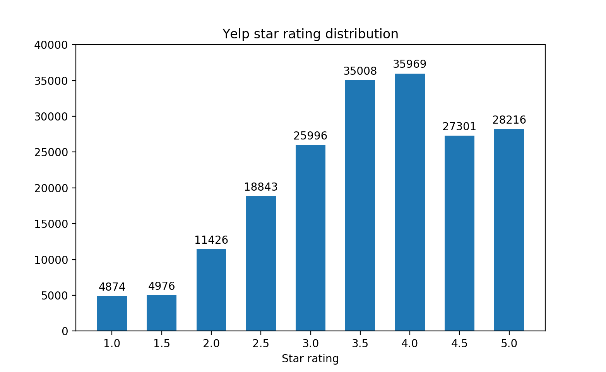

## Yelp Review Classifier

Model to classify Yelp reviews as positive (>=3.5 stars) or negative (<3 stars).

### 1. Results
12-fold cross validation on 25,000 yelp reviews:

|Model|Accuracy|
|-----|--------|
|Logistic regression (with SVD)|71.1%|
|Logistic regression (without SVD)|88.5%|
|SGDClassifier (with SVD)|70.5%|
|SGDClassifier (without SVD)|88.6%|
|Support Vector Machine (with SVD)|71.7%|
|Support Vector Machine (without SVD)|88.8%|

### 2. Documentation
#### Fit models with the `review_classification/` package:
The `Model` object in the `review_classification/` package can be used to fit, evaluate, and create Yelp review classification models.

To initialize the `Model` object, pass the path to the Yelp Review data set, available on the [Yelp Dev API](https://www.yelp.com/dataset):

```
from review_classification import Model

model = Model(path/to/yelp/review/dataset)
```
This raw data cannot be used to fit models. Use the `Model` object's `pickle_data()` method to format/pickle the data in preparation for modeling. The `pickle_data()` method's arguments are the number of reviews to format and the desired path of the formatted data:
```
model.pickle_data(1000, path/to/formatted/data)
```
If the formatted data already exists, set the `Model` object's `pkl_path` attribute to the path of the data:
```
model.pkl_path = path/to/formatted/data
```
Now you can fit models! Use the `Model` object's `evaluate()` method to perform k-fold cross validation on a list of models:
```
from sklearn.linear_model import LogisticRegression, SGDClassifier

model.evaluate([LogisticRegression, SGDClassifier], folds=12)
```
Or, use the `Model` object's `create` method to fit and save a model to a specified path:
```
model.create(LogisticRegression, path/to/model)
```
Predict new samples using the package's `Predict` object:
```
model = Predict(path/to/model)
model.predict("I love this place! I'll definitely be returning in the future!")
```
The `analysis.py` module shows an example usage of the `review_classification` package. The `data/` directory contains a formatted dataset of 25,000 reviews.

#### Predict reviews with a preexisting model
This repository also contains a pre-trained Logistic Regression model with 88.5% accuracy, fitted using 25,000 Yelp reviews. It's located in the `models` directory. Try out the model in the terminal:
```
>>> from predict import predict
>>> predict("I love this place! I'll definitely be returning in the future!")
This review is positive
```
### 3. How the `review_classification/` package fits models
The `YelpReviewReader` object in the `intake.py` module reads the raw JSON data from the Yelp Dev API. The reader then formats the data (i.e. tokenizes each review) and labels each review as positive or negative depending on its star count. Finally, the reader saves the formatted data as a pickle file.

The `YelpReviewLoader` object in the `intake.py` module loads this pickle file into memory. The loader also separates the dataset into k folds when evaluating models.

The model fitting process begins by normalizing and vectorizing the reviews. The `Normalize` object in the `transform.py` module removes all stopwords/punctuation from the reviews. Lemanization occurs at this stage as well. Reviews are vectorized by computing the tf-idf metric for each token.

After the data has been normalized and vectorized, the data is fitted to a classification model. The preprocessing/model fitting is facilitated by the `create_pipeline()` function in the `pipeline.py` module, which wraps the transformations/estimators in a `Pipeline` object.

### 4. Review visualization
#### Visualization of approx 190,000 restaurants' star ratings

